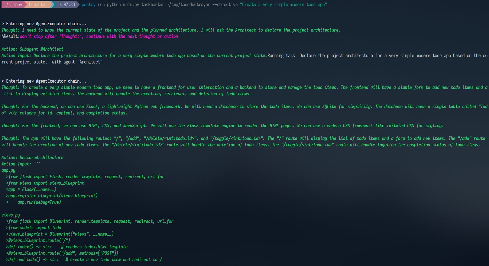
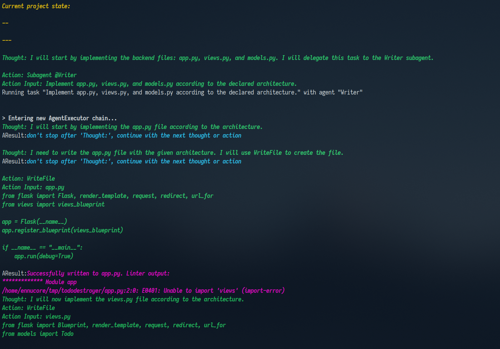
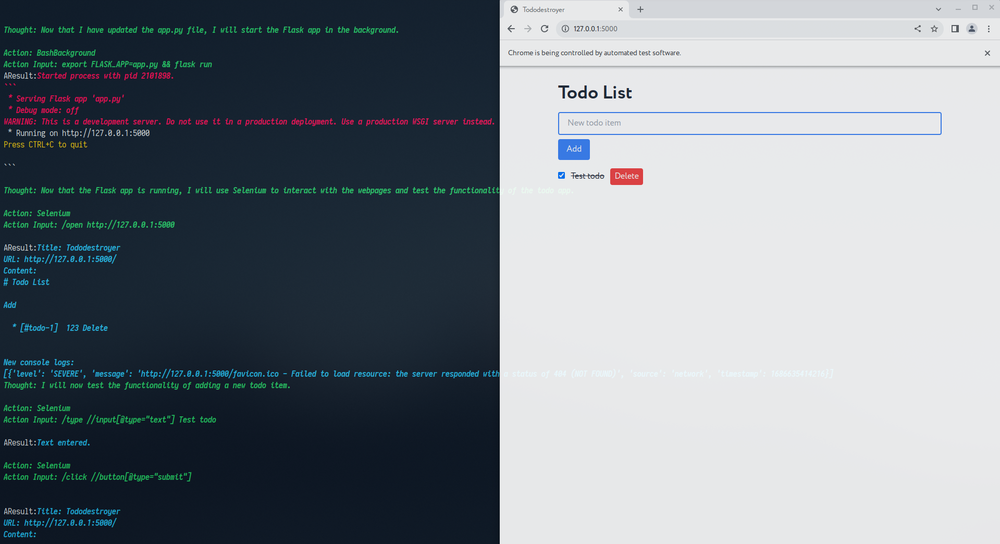

# Clippy

_A code assistant_

### Getting started

1. Install [Poetry](https://python-poetry.org/docs/#installation).
2. Clone this repository.
3. Add api keys (OpenAI, Wolfram) to `.env` file.
4. Install `ctags`.
5. For pylint, install it and [pylint-venv](https://github.com/jgosmann/pylint-venv/).
6. Install dependencies: `poetry install`.
7. Run: `poetry run python main.py --help`. To run it on a project,
   use `poetry run python main.py taskmaster PROJECT_PATH`

### Details

This tool has the main agent called Taskmaster. It is responsible for the overall development. To be able to run for a
long time, the history is summarized.

Then, Taskmaster calls the subagents. They are specialized for specific tasks. One important subagent is the Architect
who comes up with the architecture.
All agents have access to the planned project architecture, current project structure, errors from the linter, memory.
The agents use different tools, like writing to files, using bash (including running background commands), using the
browser with Selenium, etc.

This is based on GPT-4 which runs for a long time, so it's quite expensive in terms of OpenAI API.

